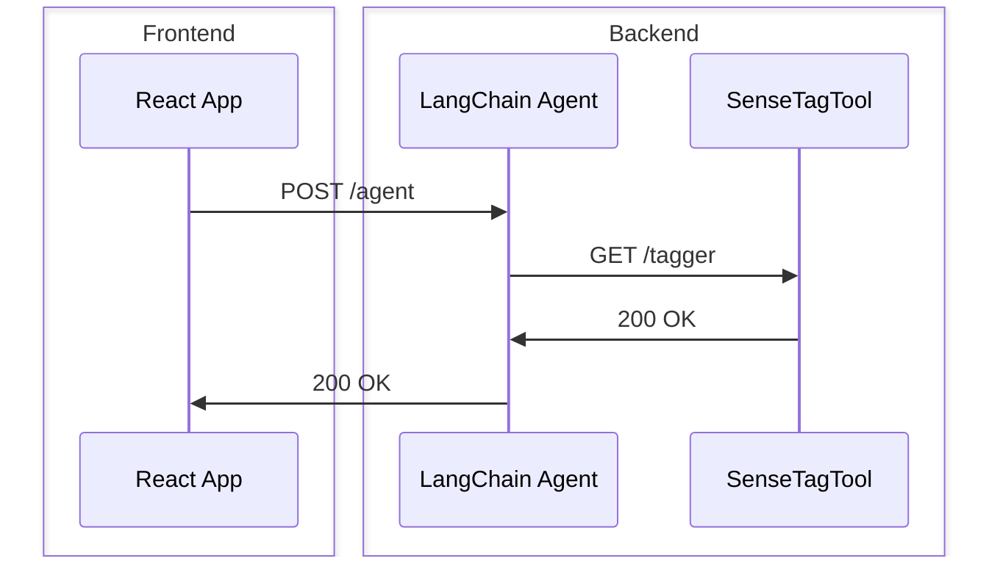

# LOPETools

## Setup

To clone repo along with submodules, run

```bash
git clone --recursive git@github.com:lopentu/lopetools.git
```

Make sure to create `.env` in the root directory and add `OPENAI_API_KEY` to `.env` if you want to use OpenAI models:

```bash
OPENAI_API_KEY="<YOUR_KEY_HERE>"
```

To install backend requirements, run

```bash
pip install poetry==1.5.1
poetry install
```

To install frontend requirements, run

```bash
cd web
npm install
```

## Quick start

To just look at usage examples, check out `notebooks/langchain.ipynb`

## Structure and starting up the frontend and backend

The frontend is a React app in `web/` and the backend is split into two parts in `src/api/`.

1. The frontend directly calls a FastAPI app that hosts a LangChain 🦜️🔗 agent in `api.main:app`
2. The SenseTagTool 🏷️ is hosted in a separate FastAPI app in `api.tagger.main:app` and is called by the LangChain agent.


Here's an unnecessarily detailed diagram of the flow:



I tried combining the agent and tagger into one app, but the agent hangs when it calls the tagger. I must be doing something wrong. 🤷‍♂️

To start the frontend, run

```bash
cd web
npm run dev
```

To start the agent, run

```bash
cd src
uvicorn api.main:app --reload --port 8003 --host 0.0.0.0
```

To start the tagger, run

```bash
cd src
uvicorn api.tagger.main:app --reload --port 3001
```

## Docker
Because of the way the host server is setup, I can't get docker-compose to work. So I have to run the app without Docker. 😭